# T1A2: Portfolio

[GitHub Repo](https://github.com/shayzimm/ca-portfolio-t1a2)

[Deployed Site](https://shayzimm.github.io/ca-portfolio-t1a2/)

## Description

Welcome to my professional portfolio website, designed to showcase my skills and projects. This site serves as a platform for potential employers and collaborators to view my work and understand my capabilities in software development.

## Purpose

The primary purpose of this portfolio is to effectively present my projects and contributions. It aims to attract professional opportunities and serve as a resume that showcases my background and experience.

## Functionality / Features

- **Project Showcase:** Each project has its own project card with a link to the deployed site or github repository.
- **Responsive Design:** Ensures that the website is accessible and visually appealing on any device, from desktops to mobile phones. This is in progress.
- **Contact Form:** Allows visitors to easily reach out to me, enhancing professional connectivity.
- **Accessibility Features:** Includes keyboard navigation and screen reader support to ensure the website is usable for people with disabilities. In progress.

## Screenshots

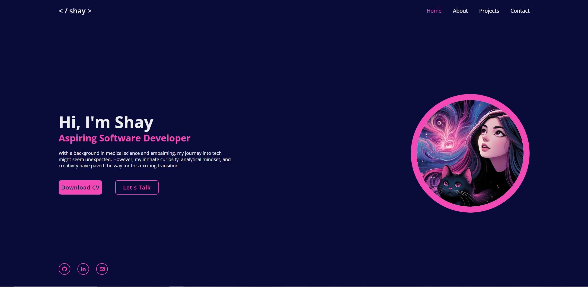
*Home page desktop view*

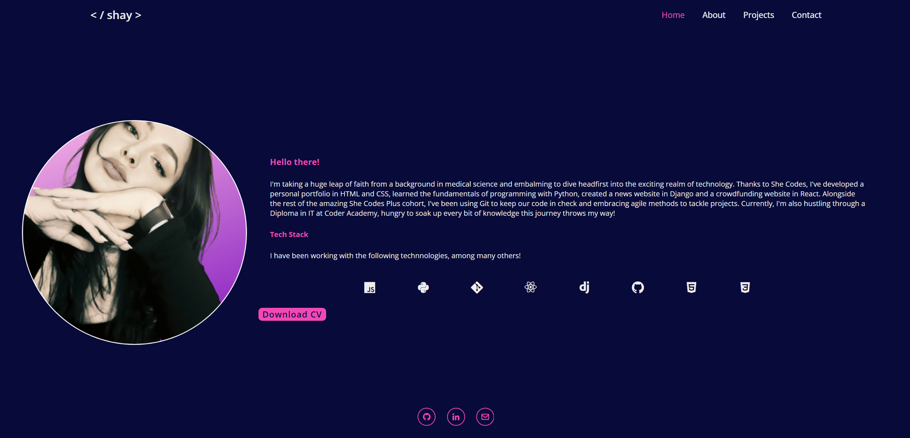
*About page desktop view*

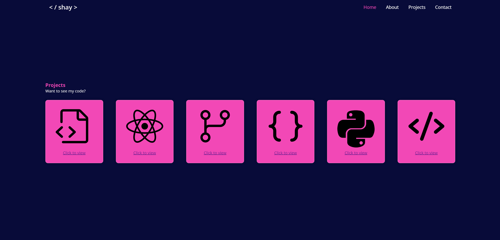
*Project page desktop view*


*Contact page desktop view*

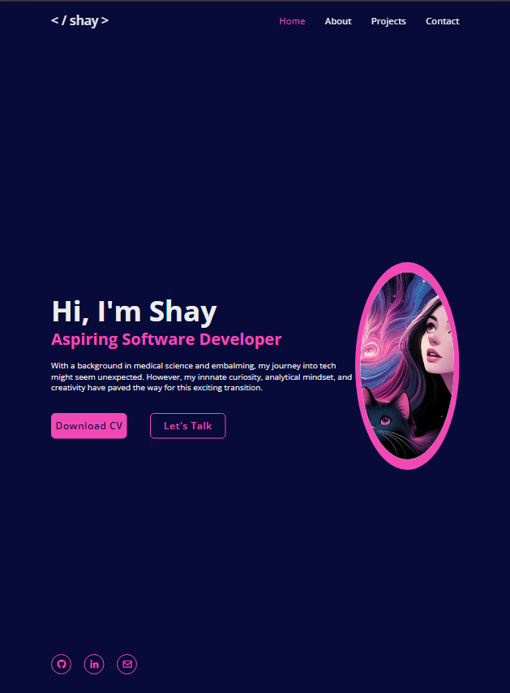
*Home page tablet view*

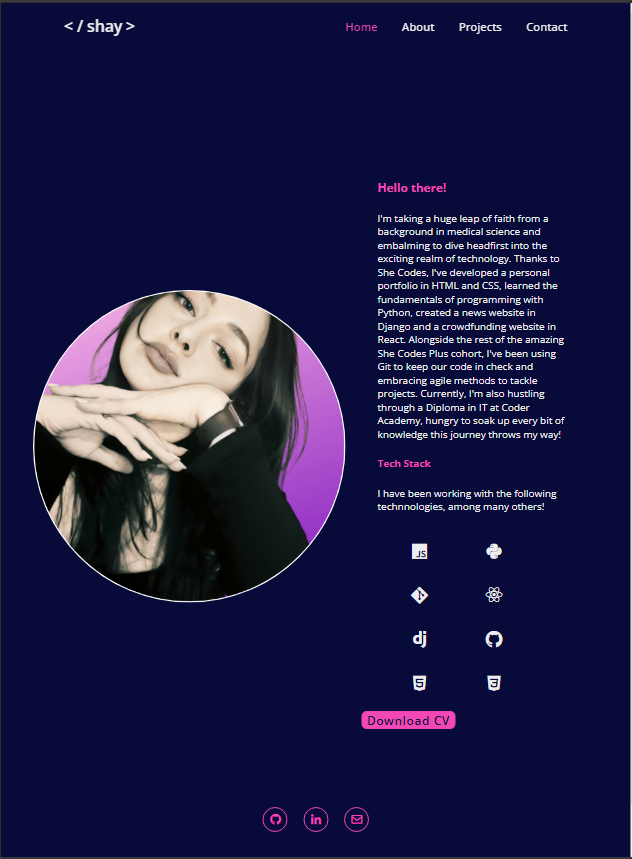
*About page tablet view*

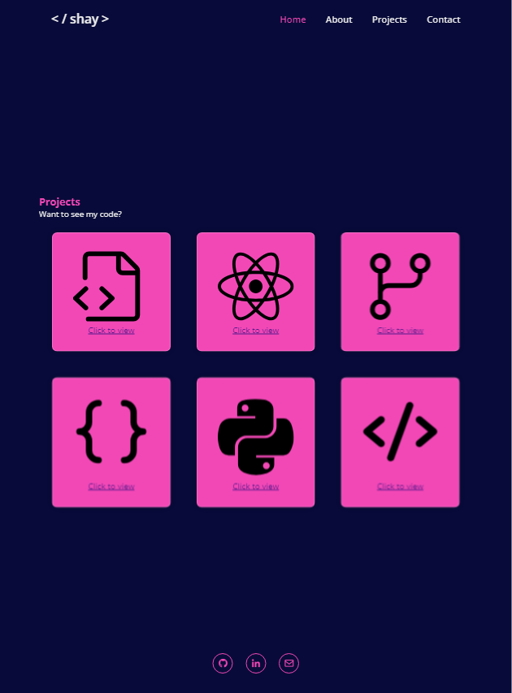
*Projects page tablet view*

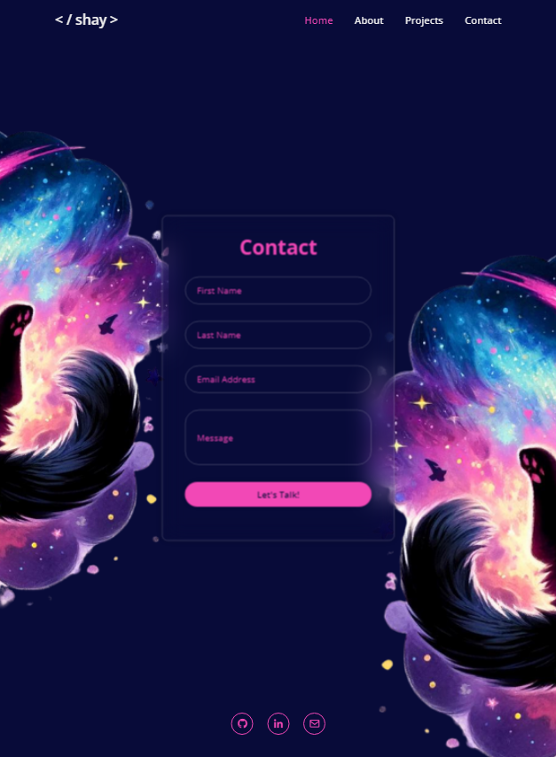
*Contact page tablet view*

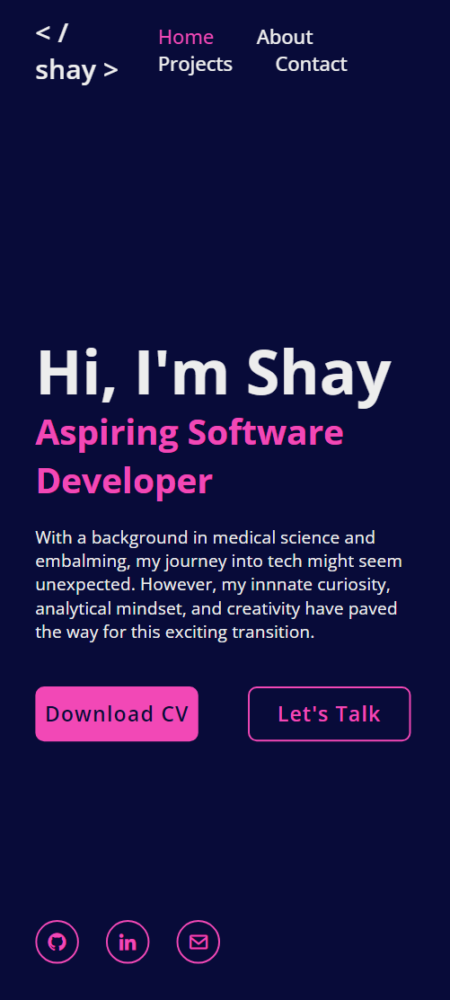
*Home page mobile view*

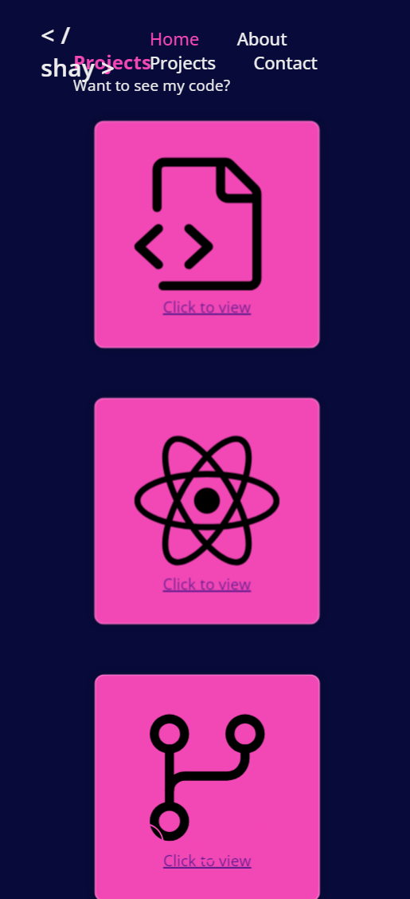
*Project page mobile view*

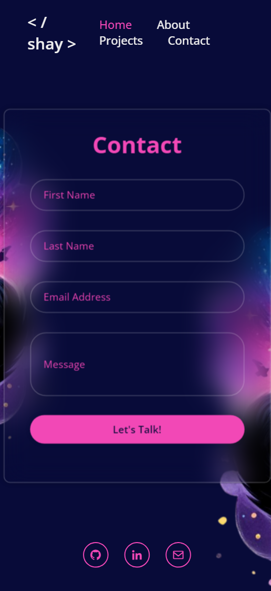
*Contact page mobile view*

## Sitemap

```plaintext
Home
├── About
├── Projects
│   ├── Project 1
│   ├── Project 2
|   ├── Project 3
│   └── Project 4
└── Contact
```

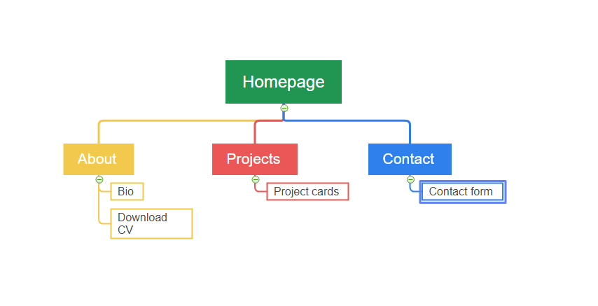

## Wireframes

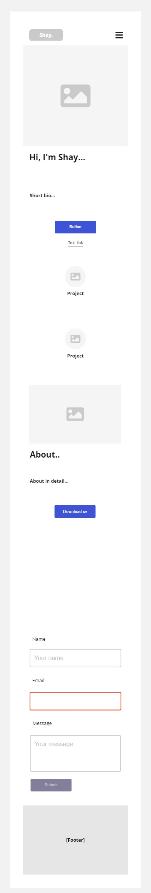

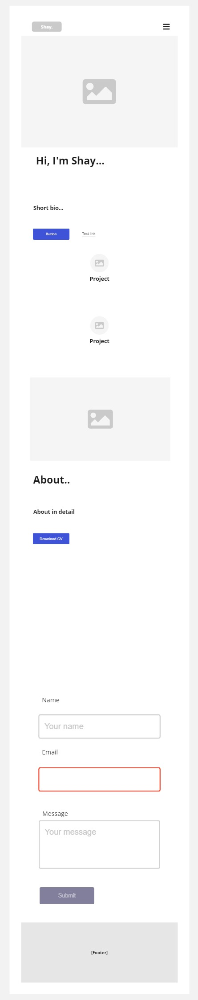

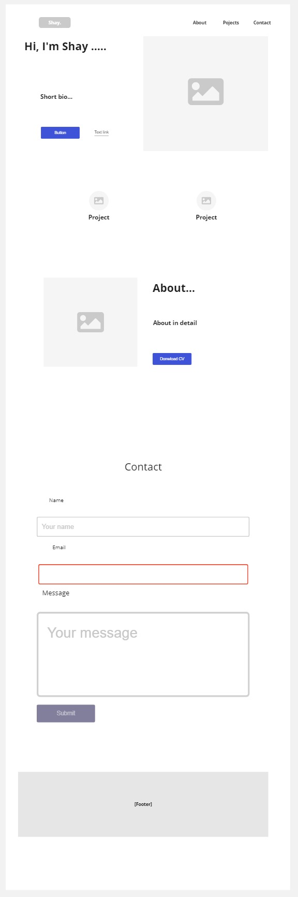

## Target Audience

The target audience for this portfolio includes but is not limited to:

- Potential employers looking to hire.
- Fellow developers seeking collaboration.
- Recruiters aiming to find talent.
- Coder Academy tutors

## Tech Stack

- HTML
- CSS
- Markdown

## Getting Started

To run this project locally, clone the repository:

````git clone https

git clone https://github.com/shayzimm/ca-portfolio-t1a2.git

cd ca-portfolio-t1a2

````
